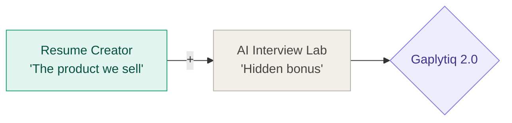
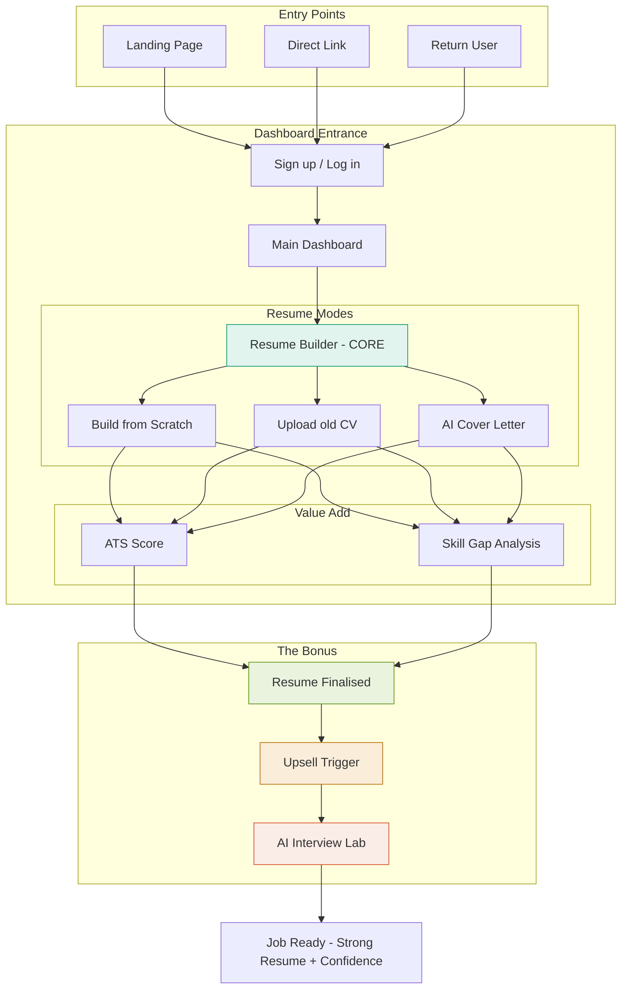

# Gaplytiq Redesign Report
> **Internal planning document — Resume-first platform strategy**

`Phase 1: Now` `Phase 2: Future` `Resumy base`

---

## What Is Gaplytiq?

Gaplytiq is a **resume creation platform** powered by AI. That is what we sell. That is what we are.

> "We build you the best resume." — full stop. That is the product.

We are taking Resumy's proven resume engine as our base architecture, redesigning the entry experience and dashboard, and rebranding the entire product under the Gaplytiq name.

The AI Interview Lab exists as a **bonus feature only** — it is not advertised, not on the landing page, and not part of the sales pitch. It quietly appears after the resume is finalised as a helpful next step. Users who discover it love it. We never lead with it.

> [!IMPORTANT]
> **The old mistake:** The original Gaplytiq was interview-only with no entry point. It flopped. Resumy works but stops at the resume. Gaplytiq 2.0 is purely a resume product — with a hidden bonus that keeps users engaged.

---

## 🏗️ Product Identity — What We Actually Are

| Source | Message |
| :--- | :--- |
| **Landing Page** | "We build your resume" (ONLY) |
| **App Experience** | Interview lab appears ONLY after resume is done. |

---

## 🚀 Phase 1 — Immediate Redesign (Build Now)

### What stays the same (from Resumy)
*   **Form Panel** — where users fill in their resume details
*   **Finalise Dashboard** — where the resume is previewed and downloaded

*These are not touched. Resumy's engine is solid and we are not rebuilding what works.*

### What changes — everything before and after the engine

### Entry Points
| Source | How they arrive |
| :--- | :--- |
| **Landing Page** | Organic search, ads, word of mouth — "We build your resume" |
| **Direct Link** | College partnerships, campus referrals, shared links |
| **Return User** | Coming back to edit a saved resume — land directly on dashboard |

### 3 Resume Modes
| Mode | What it does |
| :--- | :--- |
| **Build from scratch** | AI-guided fresh resume creation with high-end templates |
| **Upload old CV** | Auto-enhance and reformat existing documents |
| **AI cover letter** | Generate a unique, tailored cover letter per job application |

### Value-Add Analysis
These run quietly as part of the resume process:
*   **ATS Score** — real-time keyword checking against the target role.
*   **Skill Gap Analysis** — shows what skills are missing for that specific role.

---

## 🛠️ Phase 2 — Future Upgrades (Build Later)

> [!CAUTION]
> **Important:** Do not build any of Phase 2 until Phase 1 is live and stable. These are upgrades, not requirements.

### Build Order
1.  **Thin Onboarding**: Chat bubble on first login. Name, Role, Company. Instant personalisation.
2.  **Visual Polish**: Fix kerning/spacing. Replace small cards with 3 large aesthetic pillar cards.
3.  **Resume Lazy Mode**: AI autopilot in Form Panel. Type one sentence -> AI writes 3-4 bullets.
4.  **Command Hub**: Top bar routing. Dynamic greetings. Build last.

### Step-by-Step Breakdown
*   **Step 1: Thin Onboarding** — No long forms. Build this first so we know the user's role for everything else.
*   **Step 2: Visual Polish** — First impressions drive trust. Must look premium before mass use.
*   **Step 3: Resume Lazy Mode** — Biggest differentiator. Students hate filling forms.
*   **Step 4: AI Command Hub** — Minimalist search bar for routing. Needs other features to exist first.

---

## ⚙️ Technology Decisions

| Component | Decision |
| :--- | :--- |
| **Resume Engine** | Keep Resumy's architecture and code. Rebrand only. |
| **Form/Finalise** | Untouched. Zero changes. |
| **Interview Lab** | Extract from old Gaplytiq or rebuild. Bonus feature. |
| **Branding** | Gaplytiq throughout. Resumy name is retired. |
| **Main Entrance** | Dashboard. Not landing page. |

---

## 📋 Summary

| Phase | What | When |
| :--- | :--- | :--- |
| **Phase 1** | New dashboard, user flow, modes, upsell | **Now** |
| **Phase 2 - 1** | Thin onboarding (chat bubble) | After P1 ships |
| **Phase 2 - 2** | Visual polish (3 big cards) | After onboarding |
| **Phase 2 - 3** | Resume lazy mode (AI autopilot) | After polish |
| **Phase 2 - 4** | AI Command Hub (top bar) | Last |

---
> Resume is the product. Everything else supports the resume. Interview lab is a bonus that keeps users happy after they've already got what they came for.

*Gaplytiq Redesign Report — internal planning document*